# GA_portfolio
 使用遗传算法进行投资组合选择，并对比马科维茨与贝叶斯模型

 复现论文：[《Improving Portfolio Efficiency: A Genetic Algorithm Approach》](https://doi.org/10.1007/s10614-006-9021-y)

 详细代码见：https://github.com/lca-123/GA_portfolio

## 结果展示

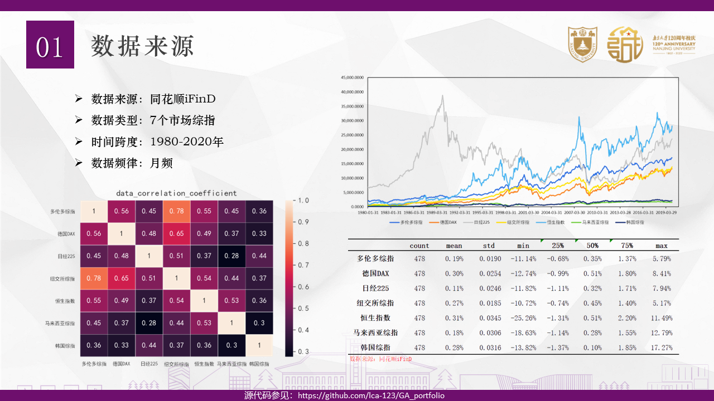

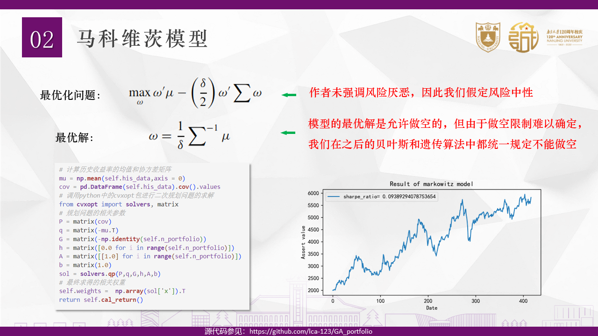

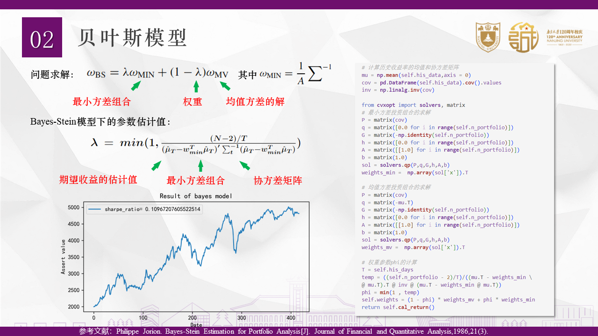

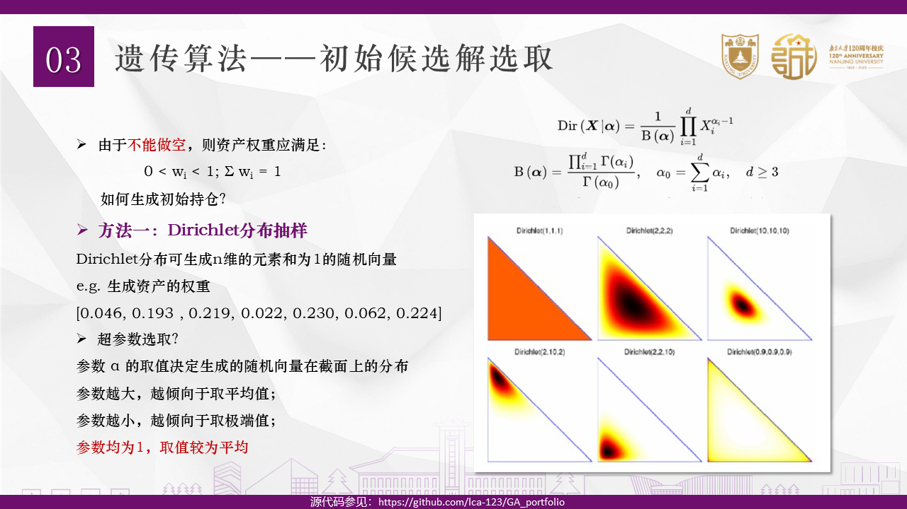

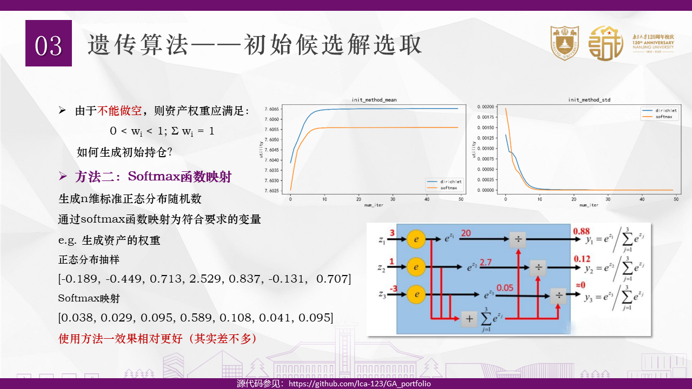

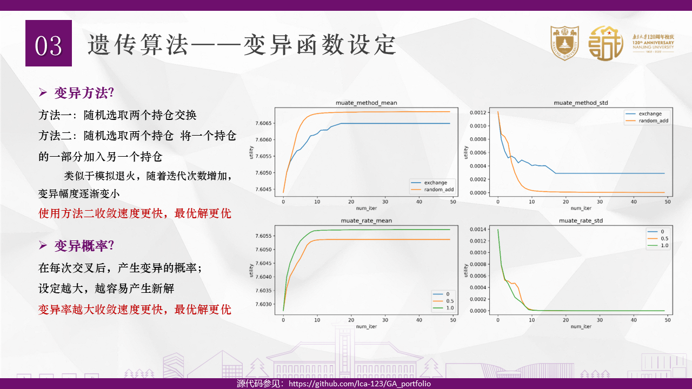

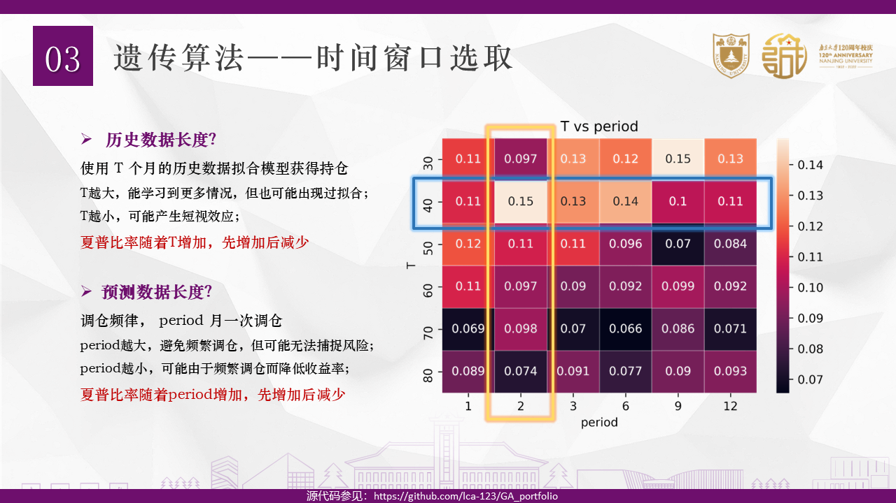

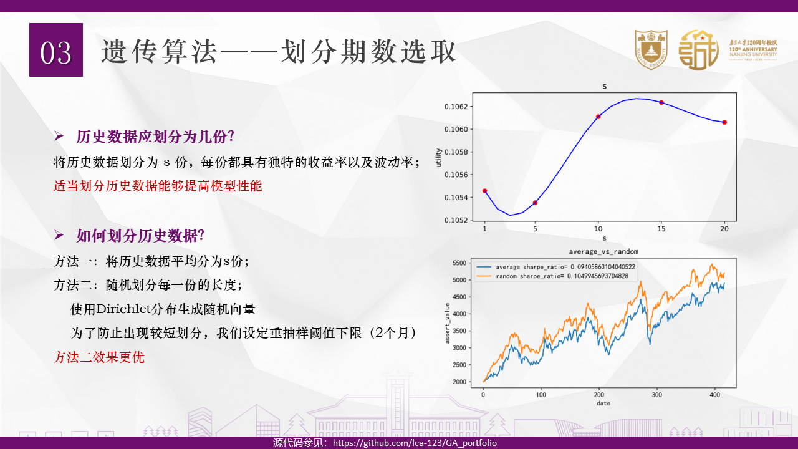

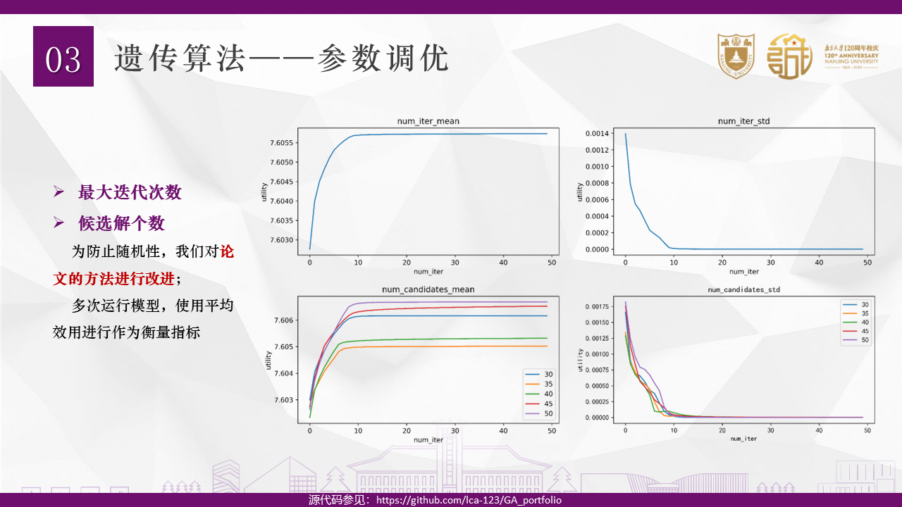

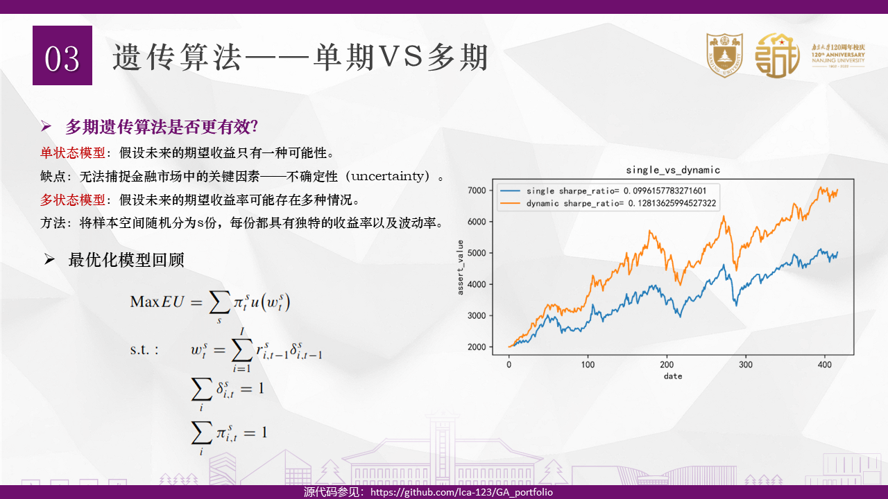

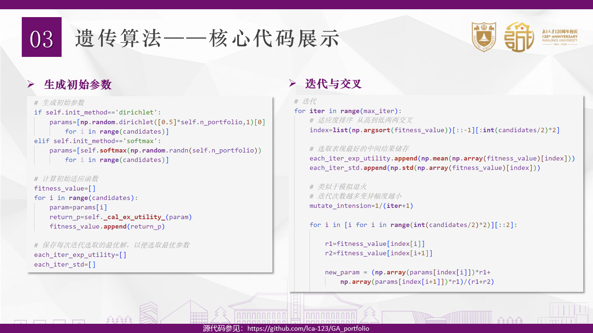

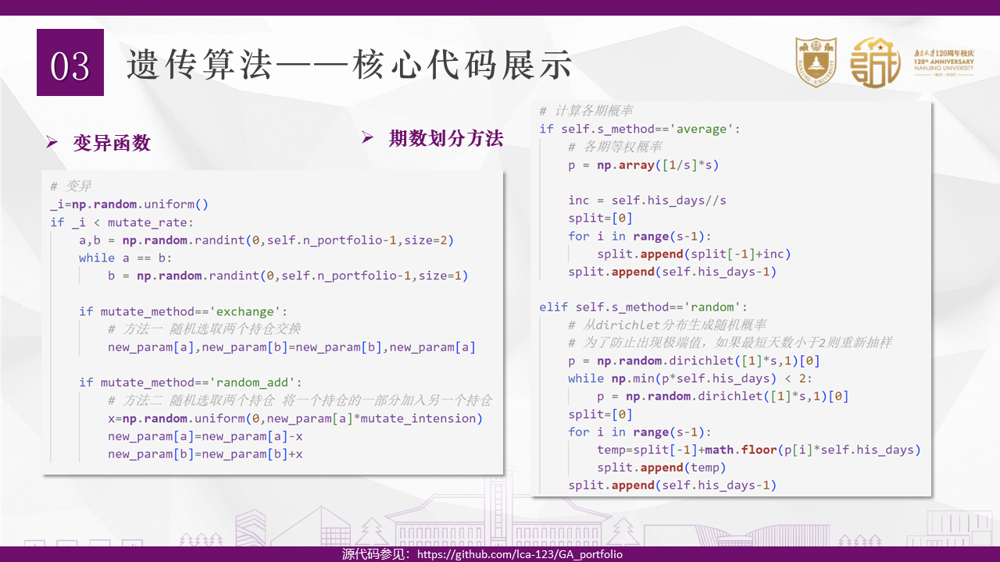

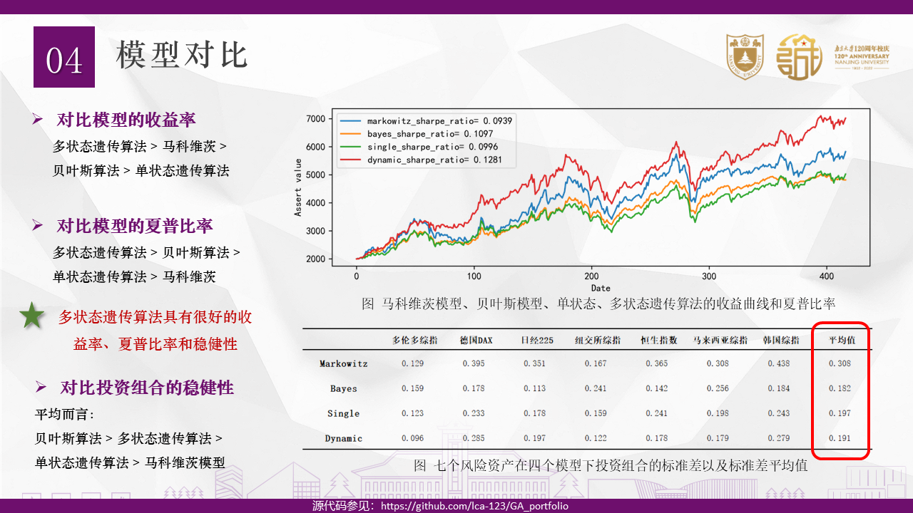